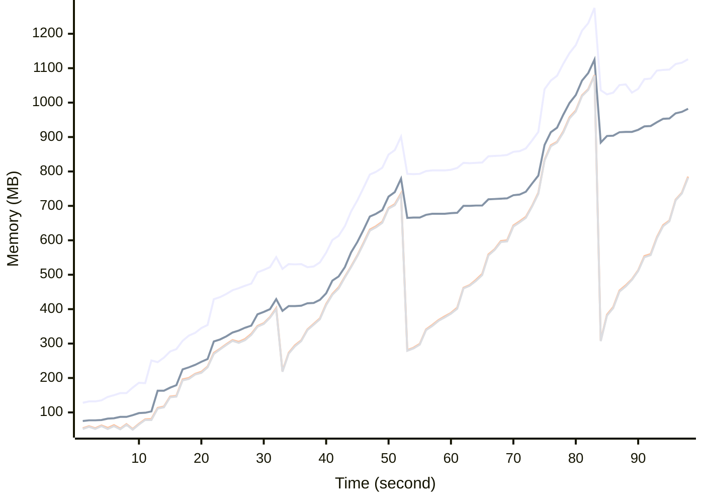

# Benchmark Report
> Generated by [`@nestia/benchmark`](https://github.com/samchon/nestia)

  - Specifications
    - CPU: AMD Ryzen 9 7940HS w/ Radeon 780M Graphics     
    - RAM: 31 GB
    - NodeJS Version: v20.10.0
    - Backend Server: 1 core / 1 thread
  - Arguments
    - Count: 8,192
    - Threads: 4
    - Simultaneous: 32
  - Time
    - Start: 2024-07-26T05:47:25.731Z
    - Complete: 2024-07-26T05:49:07.662Z
    - Elapsed: 101,931 ms

Type | Count | Success | Mean. | Stdev. | Minimum | Maximum
----|----|----|----|----|----|----
Total | 8,945 | 8,934 | 318.13 | 1,770.21 | 4 | 31,918

> Unit: milliseconds

## Memory Consumptions

> - 🟦 Resident Set Size
> - 🟢 Heap Total
> - 🔴 Heap Used + External
> - 🟡 Heap Used Only

## Endpoints
Type | Count | Success | Mean. | Stdev. | Minimum | Maximum
----|----|----|----|----|----|----
PATCH /shoppings/customers/orders/:id/discountable | 32 | 29 | 21,477.09 | 10,093.45 | 1,062 | 31,278
PATCH /shoppings/customers/carts/:cartId/commodities/discountable | 19 | 17 | 20,494.1 | 10,437.22 | 1,593 | 31,918
PATCH /shoppings/customers/carts/:cartId/commodities | 40 | 40 | 1,603.65 | 547.47 | 73 | 2,291
PATCH /shoppings/admins/coupons | 36 | 36 | 993.05 | 776.03 | 38 | 2,887
PATCH /shoppings/customers/orders | 52 | 52 | 942.38 | 765.03 | 15 | 2,202
DELETE /shoppings/admins/systematic/channels/:channelCode/categories/merge | 3 | 3 | 706.33 | 196.18 | 429 | 852
PUT /shoppings/customers/authenticate/password/change | 8 | 8 | 669.25 | 341.1 | 157 | 1,107
PATCH /shoppings/customers/sales | 37 | 37 | 471.13 | 233.78 | 49 | 1,031
PUT /shoppings/customers/orders/:id/discount | 117 | 117 | 452.87 | 242.98 | 35 | 1,379
DELETE /shoppings/admins/systematic/channels/merge | 1 | 1 | 373 | 0 | 373 | 373
POST /shoppings/sellers/deliveries/:deliveryId/journeys | 15 | 15 | 366.26 | 130.24 | 177 | 636
PUT /shoppings/sellers/sales/:id | 9 | 9 | 347 | 76.99 | 261 | 472
POST /shoppings/customers/authenticate/join | 784 | 784 | 333.95 | 337.79 | 76 | 1,944
PATCH /shoppings/sellers/orders | 12 | 12 | 322.16 | 173.58 | 122 | 728
PUT /shoppings/customers/authenticate/login | 14 | 14 | 317.28 | 257.33 | 89 | 904
POST /shoppings/customers/carts/:cartId/commodities | 614 | 614 | 288.31 | 155.56 | 25 | 1,063
POST /shoppings/customers/deposits/charges/:chargeId/publish | 68 | 68 | 286.82 | 200.64 | 23 | 1,425
POST /shoppings/customers/orders | 403 | 403 | 275.83 | 183.3 | 26 | 1,273
POST /shoppings/sellers/sales | 788 | 788 | 259.56 | 166.17 | 22 | 1,535
PUT /shoppings/admins/authenticate/login | 173 | 173 | 250.18 | 290.03 | 67 | 1,160
DELETE /shoppings/sellers/deliveries/:deliveryId/journeys/:id | 3 | 3 | 245 | 119.86 | 149 | 414
POST /shoppings/admins/systematic/channels/:channelCode/categories | 92 | 92 | 244.06 | 142.98 | 20 | 710
POST /shoppings/sellers/deliveries | 85 | 85 | 236.41 | 121.2 | 65 | 721
POST /shoppings/customers/orders/:orderId/publish | 293 | 293 | 233.12 | 139.7 | 25 | 904
POST /shoppings/sellers/sales/:id/replica | 2 | 2 | 228.5 | 33.5 | 195 | 262
POST /shoppings/customers/sales/:saleId/reviews | 91 | 91 | 212.92 | 107.89 | 25 | 595
PATCH /shoppings/admins/sales | 12 | 12 | 210.16 | 143.13 | 33 | 408
GET /shoppings/customers/carts/:cartId/commodities/:id/replica | 2 | 2 | 209 | 125 | 84 | 334
GET /shoppings/sellers/sales/:id | 20 | 20 | 196.95 | 149.76 | 48 | 590
PUT /shoppings/sellers/sales/:saleId/reviews/:reviewId/answer | 4 | 4 | 190.75 | 124.81 | 44 | 378
PUT /shoppings/sellers/authenticate/login | 22 | 22 | 190.5 | 186.47 | 65 | 940
POST /shoppings/admins/mileages/donations | 55 | 55 | 189.63 | 94.34 | 47 | 403
PATCH /shoppings/admins/systematic/channels/:channelCode/categories | 6 | 6 | 188.5 | 73.77 | 72 | 283
PUT /shoppings/admins/systematic/channels/:channelCode/categories/:id | 3 | 3 | 183 | 22.86 | 155 | 211
PUT /shoppings/customers/sales/:saleId/questions/:inquiryId/comments/:id | 8 | 8 | 180.25 | 71.59 | 54 | 282
PUT /shoppings/sellers/sales/:saleId/questions/:questionId/answer | 8 | 8 | 177.75 | 45.79 | 85 | 251
GET /shoppings/admins/sales/:id | 15 | 15 | 174.66 | 99.17 | 26 | 396
GET /shoppings/sellers/deliveries/:id | 9 | 9 | 169.88 | 43.19 | 105 | 237
GET /shoppings/sellers/sales/:saleId/snapshots/:id/flip | 8 | 8 | 169.62 | 87.25 | 74 | 297
PUT /shoppings/customers/orders/:orderId/goods/:id/confirm | 47 | 47 | 169.17 | 79.98 | 33 | 401
GET /shoppings/customers/carts/:cartId/commodities/:id | 2 | 2 | 166.5 | 118.5 | 48 | 285
POST /shoppings/customers/authenticate/external | 2 | 2 | 165.5 | 43.5 | 122 | 209
POST /shoppings/sellers/coupons | 24 | 24 | 152.2 | 61.83 | 57 | 269
PATCH /shoppings/sellers/systematic/channels/hierarchical | 797 | 797 | 140.32 | 119.95 | 8 | 1,781
POST /shoppings/customers/sales/:saleId/questions/:id | 12 | 12 | 138.25 | 49.77 | 49 | 219
POST /shoppings/sellers/sales/:saleId/reviews/:reviewId/answer | 3 | 3 | 137.33 | 28.63 | 101 | 171
GET /shoppings/sellers/orders/:id | 17 | 17 | 135.94 | 73.39 | 21 | 289
PUT /shoppings/sellers/deliveries/:deliveryId/journeys/:id/complete | 5 | 5 | 135.8 | 137.62 | 32 | 405
POST /shoppings/customers/authenticate | 1,059 | 1,059 | 134.97 | 132.24 | 10 | 1,187
POST /shoppings/admins/coupons | 762 | 762 | 134.82 | 106.96 | 15 | 842
POST /shoppings/sellers/sales/:saleId/questions/:questionId/answer | 2 | 2 | 134 | 101 | 33 | 235
POST /shoppings/admins/sales/:saleId/reviews/:inquiryId/comments | 16 | 16 | 124.06 | 79.9 | 29 | 275
POST /shoppings/customers/sales/:saleId/questions | 79 | 79 | 122.18 | 77.43 | 18 | 414
POST /shoppings/sellers/sales/:saleId/reviews/:inquiryId/comments | 16 | 16 | 120.56 | 48.25 | 35 | 206
POST /shoppings/customers/authenticate/activate | 12 | 12 | 119.75 | 73.18 | 19 | 263
POST /shoppings/customers/coupons/tickets | 22 | 22 | 118.72 | 62.99 | 23 | 283
POST /shoppings/sellers/sales/:saleId/units/:unitId/stocks/:stockId/supplements | 16 | 16 | 118.18 | 105.09 | 23 | 419
GET /shoppings/customers/sales/:id | 20 | 15 | 115.25 | 66.88 | 11 | 299
PATCH /shoppings/customers/sales/:saleId/questions/:inquiryId/comments | 27 | 27 | 113.07 | 71.55 | 18 | 265
GET /shoppings/customers/coupons/tickets/:id | 1 | 1 | 111 | 0 | 111 | 111
POST /shoppings/admins/sales/:saleId/questions/:inquiryId/comments | 31 | 31 | 109.83 | 86.32 | 18 | 279
GET /shoppings/customers/coupons/:id | 4 | 3 | 109.5 | 48.24 | 26 | 140
POST /shoppings/customers/sales/:saleId/reviews/:inquiryId/comments | 16 | 16 | 109.25 | 65.15 | 31 | 212
POST /shoppings/customers/sales/:saleId/questions/:inquiryId/comments | 33 | 33 | 108.42 | 79.61 | 18 | 323
PATCH /shoppings/customers/sales/:saleId/reviews/:inquiryId/comments | 13 | 13 | 108.15 | 54.17 | 31 | 199
DELETE /shoppings/admins/coupons/:id | 1 | 1 | 102 | 0 | 102 | 102
PATCH /shoppings/customers/coupons | 4 | 4 | 100 | 29.68 | 67 | 147
POST /shoppings/sellers/sales/:saleId/questions/:inquiryId/comments | 31 | 31 | 99.32 | 73.56 | 16 | 332
PATCH /shoppings/customers/sales/:saleId/reviews | 35 | 35 | 98.34 | 66.46 | 24 | 287
PATCH /shoppings/customers/sales/:saleId/questions | 58 | 58 | 93.37 | 55.86 | 19 | 272
GET /shoppings/customers/deposits/histories/balance | 7 | 7 | 91.42 | 79.21 | 23 | 277
GET /shoppings/admins/orders/:id | 5 | 5 | 91.4 | 61.12 | 21 | 184
GET /shoppings/customers/orders/:id | 8 | 8 | 91 | 57.15 | 30 | 219
DELETE /shoppings/sellers/sales/:id/pause | 9 | 9 | 89.44 | 72.77 | 16 | 253
PATCH /shoppings/admins/systematic/sections | 22 | 22 | 87.77 | 59.77 | 29 | 218
PATCH /shoppings/admins/systematic/channels | 16 | 16 | 87.12 | 64.67 | 25 | 249
GET /shoppings/customers/sales/:saleId/questions/:inquiryId/comments/:id | 2 | 2 | 86 | 53 | 33 | 139
POST /shoppings/admins/systematic/sections | 184 | 184 | 84.68 | 109.96 | 7 | 674
PATCH /shoppings/sellers/systematic/channels | 1 | 1 | 84 | 0 | 84 | 84
DELETE /shoppings/admins/systematic/sections/merge | 38 | 38 | 82.6 | 84.06 | 7 | 435
GET /shoppings/customers/sales/:saleId/reviews/:id | 10 | 10 | 81.59 | 55.27 | 20 | 207
PUT /shoppings/admins/systematic/channels/:id | 4 | 4 | 80.25 | 22.24 | 43 | 101
GET /shoppings/admins/coupons/:id | 3 | 3 | 70.33 | 59.95 | 24 | 155
POST /shoppings/sellers/authenticate | 531 | 531 | 69.87 | 101.02 | 7 | 844
GET /shoppings/customers/orders/:id/price | 287 | 287 | 68.55 | 55.26 | 11 | 305
POST /shoppings/customers/sales/:saleId/reviews/:id | 8 | 8 | 64 | 25.77 | 32 | 96
POST /shoppings/admins/systematic/channels | 101 | 101 | 62.61 | 52.81 | 8 | 247
GET /shoppings/admins/systematic/channels/:id | 5 | 5 | 62.6 | 48.26 | 33 | 158
GET /shoppings/admins/systematic/sections/:id | 3 | 3 | 62.33 | 30.57 | 21 | 94
DELETE /shoppings/sellers/sales/:id/suspend | 6 | 6 | 61 | 25.83 | 26 | 88
PATCH /shoppings/customers/deposits/histories | 63 | 63 | 60.68 | 44.78 | 6 | 176
POST /shoppings/customers/deposits/charges | 71 | 71 | 60.6 | 48.84 | 8 | 194
PATCH /shoppings/sellers/deliveries/incompletes | 88 | 88 | 57.28 | 40.81 | 16 | 203
POST /shoppings/sellers/deliveries/:deliveryId/shippers | 16 | 16 | 56.06 | 52.45 | 15 | 204
PATCH /shoppings/customers/mileages/histories | 49 | 49 | 55.24 | 41.39 | 15 | 185
PATCH /shoppings/sellers/sales/:saleId/units/:unitId/stocks/:stockId/supplements | 4 | 4 | 54 | 35.89 | 29 | 116
GET /shoppings/admins/mileages/:code/get | 16 | 16 | 51.18 | 36 | 15 | 145
DELETE /shoppings/admins/coupons/:id/destroy | 230 | 230 | 48.71 | 48.11 | 4 | 301
GET /shoppings/customers/mileages/histories/balance | 15 | 15 | 43.06 | 28.26 | 12 | 112
GET /shoppings/customers/sales/:saleId/questions/:id | 6 | 6 | 39.66 | 13.88 | 23 | 66
PATCH /shoppings/customers/systematic/sections | 2 | 2 | 35 | 12 | 23 | 47
PATCH /shoppings/customers/authenticate/refresh | 1 | 1 | 32 | 0 | 32 | 32
PUT /shoppings/admins/systematic/sections/:id | 1 | 1 | 24 | 0 | 24 | 24
GET /monitors/health | 2 | 2 | 23 | 11 | 12 | 34
GET /monitors/system | 1 | 1 | 13 | 0 | 13 | 13

> Unit: milliseconds

## Failures
Method | Path | Count | Failures
-------|------|-------|----------
PATCH | /shoppings/customers/orders/:id/discountable | 32 | 3
GET | /shoppings/customers/sales/:id | 20 | 5
PATCH | /shoppings/customers/carts/:cartId/commodities/discountable | 19 | 2
GET | /shoppings/customers/coupons/:id | 4 | 1