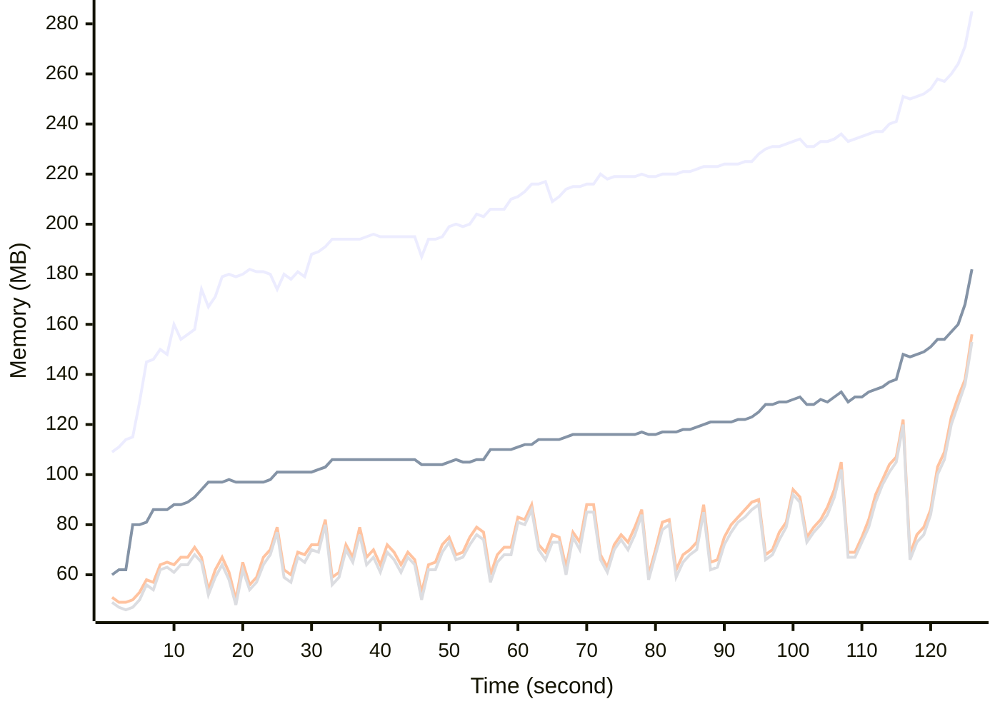

# Benchmark Report
> Generated by [`@nestia/benchmark`](https://github.com/samchon/nestia)

  - Specifications
    - CPU: AMD Ryzen 9 7940HS w/ Radeon 780M Graphics     
    - RAM: 31 GB
    - NodeJS Version: v20.10.0
    - Backend Server: 1 core / 1 thread
  - Arguments
    - Count: 8,192
    - Threads: 4
    - Simultaneous: 32
  - Time
    - Start: 2024-08-06T15:16:45.229Z
    - Complete: 2024-08-06T15:18:56.830Z
    - Elapsed: 131,601 ms

Type | Count | Success | Mean. | Stdev. | Minimum | Maximum
----|----|----|----|----|----|----
Total | 9,809 | 9,804 | 390.97 | 404.27 | 7 | 5,045

> Unit: milliseconds

## Memory Consumptions

> - 🟦 Resident Set Size
> - 🟢 Heap Total
> - 🔴 Heap Used + External
> - 🟡 Heap Used Only

## Endpoints
Type | Count | Success | Mean. | Stdev. | Minimum | Maximum
----|----|----|----|----|----|----
PATCH /shoppings/customers/carts/:cartId/commodities | 183 | 183 | 1,763.54 | 1,556.99 | 89 | 5,045
PATCH /shoppings/customers/orders | 60 | 60 | 1,121.18 | 1,272.93 | 14 | 4,032
DELETE /shoppings/admins/systematic/channels/:channelCode/categories/merge | 4 | 4 | 1,035.75 | 391.26 | 369 | 1,334
PATCH /shoppings/customers/sales | 56 | 56 | 1,008.57 | 399.62 | 316 | 1,979
DELETE /shoppings/admins/systematic/channels/merge | 3 | 3 | 909 | 217.62 | 640 | 1,173
PUT /shoppings/customers/orders/:id/discount | 202 | 202 | 836.81 | 356.49 | 86 | 1,646
PUT /shoppings/sellers/sales/:id | 13 | 13 | 666.38 | 158 | 509 | 961
PATCH /shoppings/sellers/orders | 4 | 4 | 657.5 | 163.2 | 485 | 911
DELETE /shoppings/sellers/deliveries/:deliveryId/journeys/:id | 1 | 1 | 638 | 0 | 638 | 638
POST /shoppings/sellers/deliveries/:deliveryId/journeys | 27 | 27 | 613.96 | 144.22 | 254 | 856
POST /shoppings/customers/carts/:cartId/commodities | 752 | 752 | 580.12 | 246.34 | 43 | 1,421
POST /shoppings/customers/authenticate/join | 864 | 864 | 538.55 | 288.68 | 83 | 1,975
POST /shoppings/customers/deposits/charges/:chargeId/publish | 129 | 129 | 530.07 | 240.59 | 35 | 1,125
POST /shoppings/sellers/sales | 908 | 908 | 492.64 | 206.09 | 43 | 1,476
GET /shoppings/customers/orders/:id | 48 | 48 | 488.25 | 172.73 | 143 | 954
POST /shoppings/customers/orders | 528 | 528 | 485.55 | 248.69 | 39 | 2,230
PUT /shoppings/customers/authenticate/password/change | 18 | 18 | 475.22 | 197.94 | 207 | 1,049
POST /shoppings/admins/systematic/channels/:channelCode/categories | 123 | 123 | 473.89 | 218.76 | 74 | 943
POST /shoppings/customers/orders/:orderId/publish | 388 | 388 | 438.75 | 238.8 | 21 | 1,191
POST /shoppings/sellers/deliveries | 104 | 104 | 417.09 | 202.66 | 56 | 980
GET /shoppings/sellers/sales/:saleId/snapshots/:id/flip | 12 | 12 | 415.08 | 148.84 | 202 | 603
PUT /shoppings/sellers/deliveries/:deliveryId/journeys/:id/complete | 13 | 13 | 404.61 | 245.59 | 76 | 808
GET /shoppings/sellers/deliveries/:id | 9 | 9 | 395.88 | 172.69 | 146 | 634
POST /shoppings/customers/sales/:saleId/reviews | 186 | 186 | 392.53 | 195.4 | 42 | 925
GET /shoppings/sellers/orders/:id | 13 | 13 | 371.53 | 154.17 | 169 | 770
PUT /shoppings/admins/systematic/channels/:channelCode/categories/:id | 3 | 3 | 369 | 136.39 | 177 | 481
GET /shoppings/customers/carts/:cartId/commodities/:id | 5 | 5 | 352.4 | 140.79 | 137 | 505
POST /shoppings/admins/mileages/donations | 81 | 81 | 332.96 | 164.93 | 48 | 706
GET /shoppings/sellers/sales/:id | 32 | 32 | 324.93 | 150.4 | 68 | 754
POST /shoppings/sellers/sales/:id/replica | 5 | 5 | 322.8 | 150.77 | 135 | 462
PATCH /shoppings/admins/sales | 16 | 16 | 322.5 | 179.66 | 104 | 821
GET /shoppings/customers/sales/:id | 19 | 14 | 318.21 | 130.54 | 111 | 663
POST /shoppings/customers/authenticate/external | 8 | 8 | 313.37 | 141.48 | 125 | 602
PUT /shoppings/admins/authenticate/login | 145 | 145 | 312.34 | 167.76 | 108 | 1,099
PUT /shoppings/sellers/sales/:saleId/reviews/:reviewId/answer | 12 | 12 | 307.5 | 120.31 | 99 | 467
PATCH /shoppings/sellers/systematic/channels/hierarchical | 921 | 921 | 291.84 | 162.17 | 7 | 1,372
DELETE /shoppings/admins/systematic/sections/merge | 4 | 4 | 289 | 50.2 | 228 | 358
PUT /shoppings/customers/orders/:orderId/goods/:id/confirm | 76 | 76 | 286.8 | 156.86 | 41 | 877
POST /shoppings/sellers/sales/:saleId/reviews/:reviewId/answer | 7 | 7 | 280.71 | 129.25 | 140 | 532
PATCH /shoppings/admins/systematic/channels/:channelCode/categories | 7 | 7 | 278.57 | 147.15 | 43 | 512
POST /shoppings/customers/authenticate | 1,150 | 1,150 | 276.21 | 168.27 | 10 | 1,342
POST /shoppings/sellers/sales/:saleId/units/:unitId/stocks/:stockId/supplements | 20 | 20 | 271 | 155.01 | 77 | 692
PATCH /shoppings/sellers/systematic/channels | 3 | 3 | 268 | 49.82 | 206 | 328
PUT /shoppings/sellers/authenticate/login | 36 | 36 | 258 | 122.53 | 111 | 631
GET /shoppings/admins/sales/:id | 20 | 20 | 257.6 | 129.13 | 103 | 502
PATCH /shoppings/sellers/sales/:saleId/units/:unitId/stocks/:stockId/supplements | 5 | 5 | 250.8 | 64.45 | 136 | 315
PUT /shoppings/customers/authenticate/login | 11 | 11 | 247.36 | 110.98 | 115 | 438
GET /shoppings/customers/carts/:cartId/commodities/:id/replica | 3 | 3 | 244.66 | 143.54 | 108 | 443
POST /shoppings/customers/authenticate/activate | 9 | 9 | 242.88 | 95.22 | 124 | 392
PUT /shoppings/customers/sales/:saleId/questions/:inquiryId/comments/:id | 8 | 8 | 239 | 84.38 | 164 | 441
PUT /shoppings/customers/sales/:saleId/reviews/:inquiryId/comments/:id | 8 | 8 | 235.12 | 84.76 | 136 | 363
PATCH /shoppings/admins/sales/:saleId/questions | 5 | 5 | 234.8 | 81.93 | 130 | 331
GET /shoppings/admins/orders/:id | 7 | 7 | 234.42 | 138.51 | 120 | 552
POST /shoppings/customers/sales/:saleId/questions/:id | 16 | 16 | 234.18 | 90.8 | 80 | 367
PATCH /shoppings/customers/sales/:saleId/reviews/:inquiryId/comments | 35 | 35 | 225.88 | 91.15 | 53 | 400
POST /shoppings/sellers/sales/:saleId/questions/:questionId/answer | 8 | 8 | 222.62 | 63.5 | 144 | 342
POST /shoppings/customers/sales/:saleId/questions/:inquiryId/comments | 17 | 17 | 211.7 | 100.29 | 69 | 454
POST /shoppings/customers/sales/:saleId/reviews/:id | 8 | 8 | 211.12 | 105.04 | 98 | 463
PATCH /shoppings/admins/systematic/sections | 44 | 44 | 208.77 | 100.05 | 53 | 435
POST /shoppings/sellers/sales/:saleId/reviews/:inquiryId/comments | 43 | 43 | 207.2 | 104.71 | 72 | 455
POST /shoppings/admins/sales/:saleId/reviews/:inquiryId/comments | 43 | 43 | 206.41 | 103.27 | 65 | 456
POST /shoppings/admins/sales/:saleId/questions/:inquiryId/comments | 15 | 15 | 200.73 | 84.4 | 89 | 438
PATCH /shoppings/customers/systematic/sections | 4 | 4 | 199.25 | 149.13 | 87 | 456
PATCH /shoppings/admins/systematic/channels | 8 | 8 | 195.25 | 74.43 | 54 | 293
PUT /shoppings/admins/systematic/channels/:id | 2 | 2 | 195 | 35 | 160 | 230
POST /shoppings/customers/sales/:saleId/questions | 116 | 116 | 193.67 | 95.75 | 60 | 527
PATCH /shoppings/customers/sales/:saleId/reviews | 87 | 87 | 186.86 | 104.05 | 17 | 486
PATCH /shoppings/customers/sales/:saleId/questions | 110 | 110 | 186.7 | 84.41 | 48 | 500
GET /shoppings/sellers/sales/:saleId/questions/:id | 5 | 5 | 185.8 | 113.76 | 71 | 337
POST /shoppings/sellers/sales/:saleId/questions/:inquiryId/comments | 15 | 15 | 183.6 | 63.75 | 58 | 310
DELETE /shoppings/sellers/sales/:id/pause | 15 | 15 | 182.53 | 83.77 | 63 | 399
PUT /shoppings/sellers/sales/:saleId/questions/:questionId/answer | 20 | 20 | 181.65 | 76.08 | 73 | 331
POST /shoppings/customers/sales/:saleId/reviews/:inquiryId/comments | 45 | 45 | 180.6 | 83.3 | 64 | 420
PATCH /shoppings/customers/sales/:saleId/questions/:inquiryId/comments | 12 | 12 | 177.25 | 106.72 | 74 | 405
POST /shoppings/admins/coupons | 3 | 3 | 174 | 114.94 | 59 | 331
PUT /shoppings/admins/systematic/sections/:id | 5 | 5 | 171 | 79.56 | 51 | 287
GET /shoppings/admins/systematic/channels/:id | 6 | 6 | 170.33 | 45.5 | 87 | 239
GET /shoppings/customers/sales/:saleId/reviews/:inquiryId/comments/:id | 2 | 2 | 167.5 | 107.5 | 60 | 275
PATCH /shoppings/sellers/sales/:saleId/questions | 5 | 5 | 156.4 | 75.09 | 82 | 287
GET /shoppings/customers/mileages/histories/balance | 13 | 13 | 154 | 77.78 | 21 | 319
POST /shoppings/sellers/deliveries/:deliveryId/shippers | 16 | 16 | 150.37 | 76.86 | 57 | 302
GET /shoppings/admins/mileages/:code/get | 12 | 12 | 143.08 | 72.96 | 49 | 316
POST /shoppings/admins/systematic/sections | 250 | 250 | 142.58 | 96.83 | 24 | 815
GET /shoppings/customers/sales/:saleId/reviews/:id | 13 | 13 | 142.3 | 70.79 | 65 | 279
DELETE /shoppings/sellers/sales/:id/suspend | 9 | 9 | 140.66 | 61.46 | 48 | 216
POST /shoppings/sellers/authenticate | 567 | 567 | 134.17 | 103.4 | 8 | 681
POST /shoppings/admins/systematic/channels | 78 | 78 | 127.01 | 86.95 | 24 | 491
GET /shoppings/admins/systematic/sections/:id | 9 | 9 | 125.66 | 63.86 | 46 | 216
GET /shoppings/customers/orders/:id/price | 385 | 385 | 121.02 | 81.82 | 11 | 450
GET /shoppings/customers/deposits/histories/balance | 12 | 12 | 120.58 | 52.01 | 33 | 201
PATCH /shoppings/customers/deposits/histories | 117 | 117 | 110.29 | 85.61 | 10 | 407
POST /shoppings/customers/deposits/charges | 134 | 134 | 104.7 | 69.7 | 13 | 466
GET /shoppings/customers/sales/:saleId/questions/:id | 32 | 32 | 104.68 | 59.42 | 46 | 268
PATCH /shoppings/sellers/deliveries/incompletes | 97 | 97 | 102.36 | 70.71 | 14 | 267
GET /shoppings/admins/sales/:saleId/questions/:id | 5 | 5 | 101.2 | 44.42 | 40 | 160
GET /shoppings/customers/sales/:saleId/questions/:inquiryId/comments/:id | 2 | 2 | 98 | 47 | 51 | 145
PATCH /shoppings/customers/mileages/histories | 80 | 80 | 83.35 | 77.27 | 14 | 500
PATCH /shoppings/customers/authenticate/refresh | 4 | 4 | 66 | 35.66 | 26 | 114
GET /monitors/health | 6 | 6 | 64.16 | 52.27 | 15 | 158
GET /monitors/system | 5 | 5 | 25.2 | 9.1 | 16 | 37

> Unit: milliseconds

## Failures
Method | Path | Count | Failures
-------|------|-------|----------
GET | /shoppings/customers/sales/:id | 19 | 5